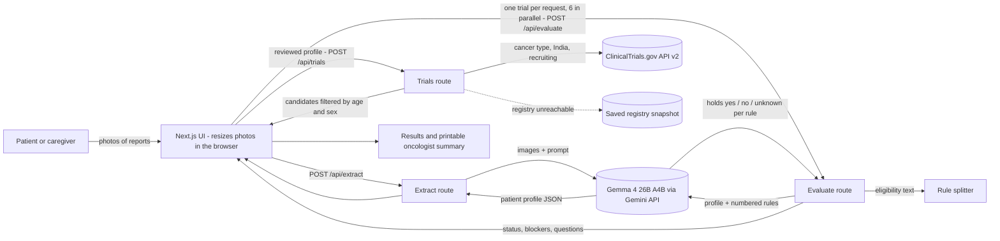

# TrialBridge

> Upload a cancer patient's medical reports and find the clinical trials recruiting in India that they may qualify for. Gemma 4 reads the reports, then checks the patient against every eligibility rule of every trial.

## Team

**Team Name:** Latent


| Member | Contribution   |
| ------ | -------------- |
| Vipin Sudhakar | [Contribution] |
| Shashank Kannan | [Contribution] |
| Anirudh S Nair | [Contribution] |
| Akshara Sree R | [Contribution] |


## Problem Statement

### The Problem

Clinical trials give cancer patients access to new treatments at no cost, often at major hospitals in India. But trials struggle to find patients, and patients don't know the trials exist. Each trial lists pages of medical eligibility rules ("HR+/HER2− breast cancer that progressed on a CDK4/6 inhibitor", "ECOG 0–1", "no active brain metastases"). Matching one patient means reading every rule of every recruiting trial for their cancer, which a patient can't do and a busy oncologist rarely has time for.

### Why We Chose This Problem

Cancer treatment pushes many Indian families into debt, while trial slots for free, cutting-edge treatment go unfilled. The information is public (ClinicalTrials.gov lists every registered trial and its rules), but there is far too much of it to read by hand. This is a problem that only makes sense to solve with an AI that can read medical documents and reason about rules at scale.

## Solution

TrialBridge turns a patient's reports into a short list of trials worth asking their oncologist about, and shows its reasoning for every rule.

1. The patient or caregiver adds photos of the reports and prescriptions (pathology, scans, clinic summaries, blood tests, the current prescription).
2. Gemma 4 reads them into a structured profile: cancer type, stage, biomarkers, every line of treatment and how it went, ECOG, labs and **current medicines**. It also shows the exact text it read each value from.
3. The user checks and corrects the profile. Nothing is matched until a person has reviewed what the AI read.
4. TrialBridge pulls every trial for that cancer that is **recruiting, with a site in India that is recruiting or about to open**, from the live ClinicalTrials.gov registry. Sites about to open are marked "opening soon". It then drops the trials the patient can't join because of age or sex.
5. For each trial, Gemma 4 judges the patient against **each eligibility rule separately**. Every trial ends up as *likely match*, *possible match* (with the open points turned into questions for the doctor) or *not eligible* (with the rule that rules it out).
6. The results list the Indian hospitals running each trial and the trial contacts, and can be printed as a one-page summary to take to the oncologist.

### Key Features

- **Reads real reports:** photos or screenshots of medical documents, read by an open-weight multimodal model.
- **Human check before matching:** an editable profile with "what Gemma read" evidence quotes.
- **Live registry data:** recruiting trials with an open (or about-to-open) site in India, from the ClinicalTrials.gov API, with a saved copy as a fallback when the registry can't be reached.
- **Rule-by-rule explanations:** a ✓ / ✗ / ? checklist for every rule, a plain-language reason for each, and the profile value it relied on.
- **Medicines meet trials:** trial rules about other drugs ("no strong CYP3A4 inhibitors", "no systemic steroids") are checked against the patient's current medicines by drug class, with end dates and washout periods taken into account. Example: a 7-day clarithromycin course that ended two days ago still falls inside a trial's 21-day window. The results group these by medicine. A rule that fails only because of a current medicine makes the trial a *possible* match with a question for the doctor ("Could clarithromycin be changed or finished before screening?"), never advice to stop it.
- **Questions for the doctor:** rules the reports don't settle become plain questions, e.g. "What is my ECOG performance status?".
- **Printable oncologist summary:** the profile, the likely and possible trials, their Indian sites and contacts, and the open questions.
- **Never claims eligibility:** results say "may qualify, confirm with your oncologist". Rules only the trial team can check (consent, contraception, screening tests) are shown separately and never decide the result.

## Innovation and Differentiation

- **Explainable matching instead of a verdict.** Research prototypes have shown that language models can match patients to trials. TrialBridge makes every decision checkable: the trial's rules are split into individual rules by plain code, and the model judges each one against the profile with a reason and evidence. One rule that fails makes the trial "not eligible", and the UI shows exactly which one.
- **Starts from what patients actually have.** That's photos of paper reports, not a structured medical record.
- **Focused on India.** It only shows recruiting trials with an Indian site that is recruiting or about to open, and names the hospitals. Trials whose Indian sites are closed or withdrawn are left out.
- **Open-weight model.** Gemma 4 is released under Apache 2.0, so a hospital could run the same model on its own servers and keep reports in-house. This build calls Gemma 4 through the hosted Gemini API.
- **Hard to do with a chat assistant.** It pulls live registry data, checks every rule of 20+ trials in parallel, and produces a consistent, printable result.

## Technical Implementation

### Architecture



### Technology Stack


| Category        | Technologies                |
| --------------- | --------------------------- |
| Frontend        | Next.js 16 (App Router), React 19, TypeScript, Tailwind CSS 4 |
| Backend         | Next.js route handlers (Node.js), zod for validating model output |
| Database        | N/A (a JSON snapshot of the registry is bundled as an offline fallback) |
| AI / ML         | Gemma 4 (`gemma-4-26b-a4b-it`) through the Google Gen AI SDK (`@google/genai`) |
| Infrastructure  | Vercel (serverless functions: up to 120 s for reading reports, 60 s per trial check) |
| APIs / Services | ClinicalTrials.gov API v2, Gemini API |


If a category or technology is not implemented in the project, specify `N/A` instead of leaving the field blank.

### How It Works

- **`app/api/extract`** sends the report and prescription images and an extraction prompt to Gemma 4 and returns a `PatientProfile`, including current medicines with their generic names, doses and end dates. Medicines marked as stopped are left out. The prompt tells the model to copy values as written, use null for anything not stated, and quote its evidence.
- **`app/api/trials`** searches ClinicalTrials.gov for recruiting trials and keeps only those with an Indian site that is recruiting or about to open (`lib/ctgov.ts`). It widens the search term if a very specific one finds nothing (e.g. "invasive ductal carcinoma of breast" becomes "breast cancer"), filters by age and sex, and puts trials for the patient's stage first. If the registry can't be reached, it answers from `data/ctgov-snapshot.json` (refresh with `npm run snapshot`).
- **`lib/criteria.ts`** splits each trial's loosely formatted eligibility text into individual inclusion and exclusion rules. It handles nested sub-rules, numbered lists, escaped characters and "other criteria may apply" notes.
- **`app/api/evaluate`** checks one trial: Gemma 4 receives the profile and the numbered rules (in parallel batches of 20 for long lists) and answers, for each rule, whether it holds for the patient (`yes` / `no` / `unknown`), plus a reason, evidence and a question for unknowns. **`lib/match.ts`** turns that into pass / fail / unknown per rule and a trial status.
- **The UI** (`components/`) runs the evaluate calls six at a time and shows results as they arrive. It also holds the profile editor and the print layout.

### Technical Decisions

- **The model judges rules, code decides the outcome.** Splitting rules and combining verdicts are plain, unit-tested code. The model only answers one narrow question per rule, which keeps results explainable and consistent.
- **No double negatives.** For an exclusion rule the model is asked whether the exclusion *applies*, not whether the patient "passes" it. `lib/match.ts` flips the answer, which avoids a common source of errors with exclusion criteria.
- **One trial per request, several in parallel from the browser.** The UI shows progress, and one failed trial can be retried without redoing the rest.
- **A fixed time budget per request.** All Gemma attempts for one request (retries included) share a 55 s budget, under the route's 60 s limit, so a slow reply ends in a clear JSON error rather than a hosting timeout. Long rule lists are checked in parallel batches of 20; the longest trial we found (62 rules) finishes in about 35 s.
- **Every rule must be answered.** A reply that skips any rule id is rejected and retried, so a missed rule never quietly turns into "possible".
- **Minimal thinking mode.** With the model's default settings, checking 4–5 trials in parallel took about 3 minutes per trial. With thinking set to minimal (the medical reasoning hints are written into the prompt instead), one check took 26 s and used no thinking tokens, and 4 trials finished in 42 s in parallel. All Gemma attempts for one request share a fixed time budget (see below).
- **Medicine rules are date-aware and tied to real medicines.** The rule-check prompt includes today's date, so short courses and washout windows are judged correctly. A medicine Gemma links to a rule is kept only if it matches one of the patient's current medicines, and is reported by its generic name (`linkMedicine` in `lib/match.ts`).
- **Rate limits are expected, not fatal.** When Gemma's free tier says "slow down", the API answers `429` with `retryAfterSeconds`, and the UI waits and retries that trial by itself. The rule-check prompt is kept compact to use fewer tokens, and trials are checked three at a time.
- **Lenient parsing, strict use.** Replies are validated with zod. A malformed field falls back to "not stated", and an unusable reply is retried once with the validation error attached.
- **Photos are shrunk in the browser** (longest side 1600 px, JPEG) to stay within hosting request-size limits and keep uploads fast on mobile data.

## Implementation During the Hackathon

Everything in this branch was built on 8 October 2026 during the Hack Day:

- the ClinicalTrials.gov client, age/sex filtering, search widening and the offline registry snapshot
- the eligibility rule splitter, tested against real registry records (33 trials, 579 rules in a sanity run)
- the Gemma 4 client with JSON validation, retries and timeouts, plus the extraction and rule-checking prompts
- the match logic (verdicts, status, doctor questions, ranking), with unit tests (`npm test`)
- the three API routes and the full UI: upload, profile review, live matching, results with rule checklists, and the printable summary
- two synthetic sample patients, each with a clinic summary and a prescription (`samples/`, rendered to `public/samples/`), for demos and testing
- the medicines feature: current medicines are read from prescriptions, and trial rules about other drugs are checked against them
- deployment to Vercel, with time budgets per route and rate-limit handling

**Checks on 8 Oct 2026 (local):**
- **In the browser, end to end:** for the synthetic metastatic breast cancer patient, the profile was read in about 35 s, and 21 recruiting trials in India were checked in about 2 minutes. The trial the sample was written to fit, NCT06312176 (HR+/HER2− metastatic breast cancer after CDK4/6 inhibitor progression), came out as a likely match.
- **Through the API:** an early-stage trial (NCT02992574) and a triple-negative trial (NCT06103864) came out as not eligible, citing the stage and receptor rules.

### Team Contributions

- **[Member Name]:** [Contribution]
- **[Member Name]:** [Contribution]
- **[Member Name]:** [Contribution]
- **[Member Name]:** [Contribution]

## Working Application

**Live Application:** https://trialbridge-beta.vercel.app

1. Open the link and click a **sample patient** (synthetic reports), or upload photos of real reports.
2. Reading the reports takes about 30–60 seconds. Review the profile, then click **Find matching trials**.
3. Checking every recruiting trial in India takes about 2 minutes. Results appear as each trial finishes.
4. Open any trial to see its rule-by-rule checklist, and use **Print summary for your oncologist**.

The live app runs on Gemma's free tier. If many people use it at once, it may say Gemma is busy; wait a minute and try again.

## Demo Video

**Demo Video:** [Video URL]

[Provide a short demonstration of the working project, covering the main user flow and important functionality.]

## Open Source and AI Usage

### AI / Models

- **Gemma 4 26B A4B (`gemma-4-26b-a4b-it`)**, an open-weight model by Google DeepMind released under the [Apache 2.0 license](https://ai.google.dev/gemma/apache_2), called through the Gemini API. It does two things:
  - reads report images into the patient profile (multimodal extraction)
  - judges each eligibility rule of each trial against that profile, with a reason, evidence and a doctor question

  It does **not** decide the final status; `lib/match.ts` does. `GEMMA_MODEL` can be set to `gemma-4-31b-it` for the larger dense model (slower in our tests).

### Open Source Components

- **Next.js** (MIT), **React** (MIT), **Tailwind CSS** (MIT), **zod** (MIT), **TypeScript** (Apache 2.0): the application framework, UI and validation.
- **Google Gen AI SDK, `@google/genai`** (Apache 2.0): the client for the Gemini API.
- **Atkinson Hyperlegible Next** and **Source Serif 4** (SIL Open Font License, via Google Fonts): the UI fonts.
- **ClinicalTrials.gov API v2** (U.S. National Library of Medicine): live trial records. Trial records shown in the app and in `data/ctgov-snapshot.json` come from ClinicalTrials.gov. TrialBridge is not affiliated with or endorsed by the National Library of Medicine.
- **Sample reports:** the two patients in `samples/` are synthetic and the hospital is fictional. No real patient data is used or stored.

## Setup and Usage

### Prerequisites

- Node.js 22.18 or newer (developed with Node.js 24.19)
- A free Gemini API key from [Google AI Studio](https://aistudio.google.com/apikey)

### Installation

```bash
git clone https://github.com/vipinsudhakar/hacktoberfest-hack-day-coimbatore-x-init-club-and-idea-club.git
cd hacktoberfest-hack-day-coimbatore-x-init-club-and-idea-club
npm install
```

### Environment Variables

Copy `.env.example` to `.env.local` and fill in the key:

```env
GEMINI_API_KEY=your-key-from-ai-studio   # optional backup keys after it, comma-separated, used only if a key is rejected
GEMMA_MODEL=gemma-4-26b-a4b-it
```

### Running the Project

```bash
npm run dev        # http://localhost:3000
npm test           # unit tests for the rule splitter, registry helpers and match logic
npm run snapshot   # optional: refresh the offline copy of the registry
```

### Usage

1. Open the app and add photos of the patient's reports, or click a **sample patient**.
2. Wait for Gemma 4 to read them (about half a minute), then check and correct the profile. The cancer type is what the registry is searched for.
3. Click **Find matching trials** and watch the trials get checked.
4. Open a trial to see every rule with ✓ / ✗ / ?, its sites in India and its contacts.
5. Click **Print summary for your oncologist**.

TrialBridge is a screening aid, not medical advice. Only the trial team can confirm eligibility.

## Challenges and Learnings

- **Latency was the first wall.** The first parallel runs took about 3 minutes per trial. The same check with thinking set to minimal took 26 s and used no thinking tokens. We switched, wrote the medical connections into the prompt instead (stage IV means metastatic, HER2 IHC 1+ is HER2-negative, which drugs are CDK4/6 inhibitors), and a 4-trial batch dropped to 42 s.
- **Real eligibility text is messy.** Registry criteria mix headings with and without colons, `*` and numbered bullets, nested sub-rules, escaped characters and boilerplate notes. We built the splitter against real records and kept fixing it until a sanity run over 33 trials produced clean rules.
- **Exclusion criteria invite double negatives.** Asking "does the patient pass this exclusion?" was ambiguous, so we ask "does this exclusion apply?" and flip the answer in code.
- **Free-tier rate limits.** On the first live run, 9 of 19 trials couldn't be checked because Gemma's free tier was busy. We added `429` responses with Gemma's suggested wait, automatic retries in the UI (with a visible countdown), fewer parallel checks and a more compact prompt.
- **Dates matter for medicines.** Without today's date, the model treated a course that had already ended as current. Adding the date fixed it, and it now reasons about washout windows.
- **Hosting limits shape the design.** Request size and duration limits led to shrinking photos in the browser and checking one trial per request.

## Devpost Submission

**Devpost Project:** [Devpost Project URL]

[Add the link to the team's Devpost submission. Ensure the Devpost project page is complete and contains the required project information, links, media, and team details.]

## Credits and License

### Credits

- [Gemma 4](https://ai.google.dev/gemma) by Google DeepMind ([Apache 2.0](https://ai.google.dev/gemma/apache_2)), via the [Gemini API](https://ai.google.dev/gemini-api)
- Trial data from [ClinicalTrials.gov](https://clinicaltrials.gov) (U.S. National Library of Medicine) through its [public API](https://clinicaltrials.gov/data-api/api)
- Next.js, React, Tailwind CSS, zod, TypeScript and the Google Gen AI SDK, used under their open-source licenses (see above)
- Fonts: Atkinson Hyperlegible Next (Braille Institute) and Source Serif 4 (Adobe), SIL Open Font License

### License

[MIT](LICENSE)

## Submission Checklist

- [x] Project title and description added
- [x] All team members listed
- [x] Problem clearly explained
- [x] Reason for choosing the problem explained
- [x] Solution and key features documented
- [x] Innovation and differentiation explained
- [x] Architecture included
- [x] Technical implementation documented
- [x] Work completed during the hackathon documented
- [ ] Team contributions documented
- [ ] Working application is functional
- [x] Live application link added where applicable
- [ ] Demo video added
- [x] AI and open-source components documented
- [ ] Setup and usage instructions tested
- [x] Challenges and learnings documented
- [ ] Devpost submission completed
- [ ] Devpost link added
- [x] Credits added
- [x] License added
- [ ] Repository is organized and complete
